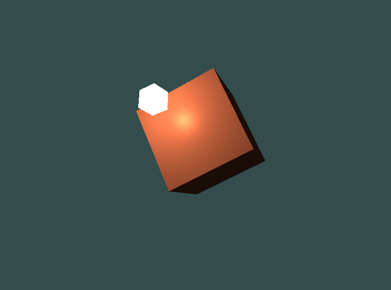
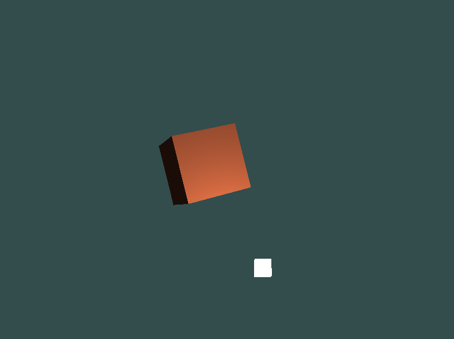

# Learning OpenGL
This is my implementation of a basic renderer, built while reading LearnOpenGL's chapters:
- Getting Started
- Lighting

It requires following dependencies:
- OpenGL >= 3.3
- GLAD
- GLFW
- stb/stb_image.h

Ensure that they are added in the *include* directory.

To build, use the following commands **once** in the root directory of the cloned repo:
```bash
mkdir build
cd build
cmake ..
make
```
Now you've got the executable in the *build* directory. 
To run, ensure that it is your working directory and use the following command:
```
./OpenGLTest
```
## Features

- Shader abstraction
- Texture abstraction
- FPS camera
- Basic Phong lighting
- Model/View/Projection transformations

## Screenshots




